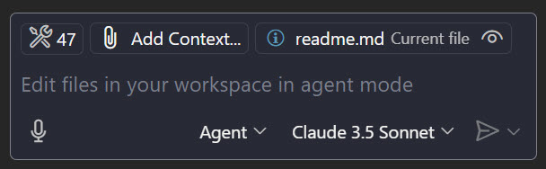

# Prompt Guide

- **Task 1**: Work with GitHub
- **Task 2**: Setup Coding Instructions & Tooling
- **Task 3**: Scaffold project structure
- **Task 4**: Implement the .NET Web API
- **Task 5**: Implement the Angular Frontend
- **Task 6**: Add project documentation using a reusable prompt

The Tasks were executed by the GutHub Copilot Agent mostly using Claude Sonnet 3.5 with these [Visual Studio Code Settings](/docs/assets/settings.json)



## Task 1: Work with GitHub

This task is an introduction to using GitHub Copilot in a collaborative environment. It covers creation of a branch, committing changes and creating pull requests.

```prompt
Create a new branch '<name>-solution' and switch to it
```

After switching to the new branch, delete the src folder and commit the changes.

> Note: Do not worry about the deletion as the solution is still available in the master branch and for your reference in [/docs/solution](/docs/solution/).

## Task 2: Setup Coding Instructions & Tooling

This task install some Copilot Settings and Tools and establishes the foundation for our fitness tracking application according to `docs/octofit_story.md`

```prompt
1. Setup the coding instructions and tooling for the project mentioned in docs/mona-high-school-fitness-tracker.md.

2. Do not change any content of the files you copy.

3. Before starting the implementation, share your plan. Keep the order of the tasks. Don't proceed with the next activity until all of these steps are completed.
```

- Create a development container configuration for consistent environments and easy onboarding of new team members by attaching the re-usable prompt `create-dev-container.prompt.md` with the paperclip icon in the GitHub Copilot chat:

> Note: Skip this step as we have already created the devcontainer.json to meet our 45 min time limit. Building the container image takes a while. The prompt is included for reference.

```prompt
Create the devcontainer for the project.
```

- Run the `devcontainer` locally using `Dev Containers: Open Workspace in Container`. This will build the container image and start the container.

- Run the `devcontainer` in `GitHub CodeSpaces`: Codespaces: Connect to Codespace. This will create a new Codespace and open the project in the container.

## Task 3: Scaffold the projects

Create both the .NET API and Angular frontend projects according to the guides in `docs/mona-high-school-fitness-tracker.md`.

It includes setting up proper project structures, defining development environments with devcontainer configurations, and establishing basic project hygiene like source control settings.

- Get a big picture of the project using the `docs/octofit_story.md` and `docs/mona-high-school-fitness-tracker.md` files:

  ```prompt
  Read the files docs/octofit_story.md and docs/mona-high-school-fitness-tracker.md and summarize the requirements of the project. Do not implement anything yet. Just get an overview of the requirements. Draw a directory tree of the project.
  ```

- Use `scaffold-api-project.prompt.md` to scaffold the webapi

- Use `sccaffold-ui-project.prompt.md` to scaffold the Angular frontend

- Check the outcome of the scaffolding process using the Playwright MCP Tools that we registered:

  ```prompt
  The octofit-api and octofit-ui are already running. Navigate to `http://localhost:4200/` using the browser and describe the result.
  ```

## Task 4: Implement the .NET Web API

This task focuses on setting up the back-end API functionality including data models, controllers, and database integration. It establishes the core business logic and data access layer that will serve student and exercise data to the Angular frontend. Details are defined in `docs/mona-high-school-fitness-tracker.md`

- Use `implement-api.prompt.md` to implement the Web API

> Note: You can smoke test the WebApi by creating a REST Client file:

```bash
In src/octofit-api create a REST client test-user-controller.http in wich you test all methods of the UserController
```

## Task 5: Implement the Angular Frontend

This task implements the front-end user interface by creating Angular components, services, and routing configurations. It establishes the connection between the Angular app and the .NET API, ensuring proper data display and user interaction.

- Creating the HomeComponent, NavbarComponent, basic routing and the client side models and services by executing the `implement-ui-models.prompt.md` prompt.

  > Note: If you want you can test the application after implementing the components using the Playwright MCP Tools that we registered:

  ```prompt
  The octofit-api and octofit-ui are already running. Navigate to `http://localhost:4200/` using the browser and describe the result.
  ```

- Create the LeaderboardComponent and implement the leaderboard list using the `implement-ui-leaderboard.prompt.md` prompt.

- Create the UsersComponent and the UsersEditComponent using the `implement-ui-users.prompt.md` prompt.

## Task 6: Add project documentation using a reusable prompt

This task improves the project's documentation by leveraging reusable GitHub Copilot prompts. It demonstrates how to create, attach, and utilize custom prompts to generate comprehensive documentation for the application.

- Create docs using `create-docs.prompt.md`
