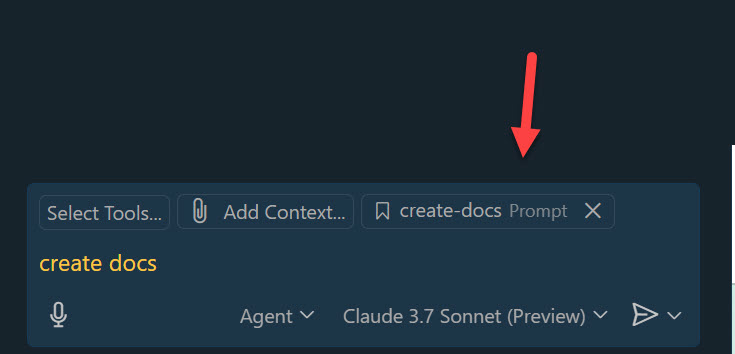
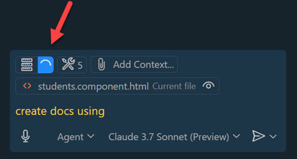

# Prompt list

- [ ] **Task 1**: Work with GitHub
- [ ] **Task 2**: Project Setup including a devcontainer.json
- [ ] **Task 2**: [Implement the Web Api using Vibe Coding](#task-2-configure-the-web-api)
- [ ] **Task 3**: [Implement the Angular App using Vibe Coding](#task-3-configure-the-angular-app)
- [ ] **Task 4**: [Add project documentation using a reusable prompt](#task-4-add-project-documentation-using-a-reusable-prompt)
- [ ] **Task 5**: [Implement & Integrate a Playwright MCP (Model Context Protocol) Service](#task-5-implement--integrate-a-playwright-mcp-model-context-protocol-service)
- [ ] **Task 6**: Implement tests using Vibe Coding
- [ ] **Task 7**: Implement Bicep in infra folder using Vibe Coding(#task-7-implement-bicep-in-infra-folder-using-vibe-coding)
- [ ] **Task 8**: Add a CI/CD pipeline using Azure DevOps

> Note: Task 6-8 are not included in this repository. They are [GitHub Issues](https://github.com/alexander-kastil/copilot-skills-fest/issues) waiting to be addressed.

The Tasks were executed by the GutHub Copilot Agent mostly using Claude Sonnet 3.7 with these [Visual Studio Code Settings](/prompts/assets/general/settings.json)


## Task 1: Work with GitHub

This task is an introduction to using GitHub Copilot in a collaborative environment. It covers creation of a branch, committing changes and creating pull requests.

```prompt
Create a new branch 'initial-setup' and switch to it
```

> Note: At the end of task 2 we will merge the branch into main.

## Task 2: Project Setup

This task establishes the foundation for our fitness tracking application according to `docs/octofit_story.md` by creating both the .NET API and Angular frontend projects according to the guides in `docs/mona-high-school-fitness-tracker.md`. It includes setting up proper project structures, defining development environments with devcontainer configurations, and establishing basic project hygiene like source control settings.

- Initial prompt to set up both .NET and Angular projects:

  ```prompt
  I want to create a project that satisfies the requirements of docs/octofit_story.md. The requirements are already installed on the machine, so Do not use && to chain commands
  . The projects should be created in the src directory.

  - .NET 9.0 Web API that uses Entity Framework Core and SQLit.
  - Angular 19 App that acts as a frontend.

  The .NET 9.0 Web API project should be created with the dotnet new webapi -n fitness-api command.

  Create the .NET 9.0 Web API project (fitness-api) and the Angular 19 App project (fitness-ui). When creating the Angular Front use the angular cli with the ng new fitenss-ui --routing --style=scss --ssr=false command. After creating the Angular project, create angular environments using 'ng g environments' and add apiUrl to both environments. The apiUrl should be set to apiUrl="http://localhost:5000/"
  ```

- Adding proper gitignore files for both projects:

  ```prompt
  Add .gitignore to the two projects reflecting their stack
  ```

- Add a `.github/copilot-instructions.md` from [assets](/prompts/assets/general/) file the defines general instructions for code generation and project specific instructions for Angular and .NET:

  ```markdown
  # Code Instructions

  ## General

  We write our code on a Windows Machine. Never use `&&` to chain commands. Always use separate commands.

  ## Angular

  We are using Angular 19. Always use functional implementation where possible

  ## .NET

  ```

  > Note: Typically you would add issues to this file, when noticing unwanted code-generation behavior.

- Run and commit to the main branch.

- Explain Context. Mention that we will recycle the context soon. But before we will create a devcontainer.json file:

- Creating a development container configuration for consistent environments:

  ```prompt
  to finalize the initial setup create a devcontainer.json that is capable of running Angular 19 with min node 20.12.2 and the .net 9 sdk. Please look at my installed extensions and add the Angular and .NET related extensions to the devcontainer. Include the GitHub CLI and make sure the post-create script to ensure appropriate permissions are set during container startup
  ```

- Run the `devcontainer` locally and using `GitHub CodeSpaces`

## Task 2: Configure the Web Api

This task focuses on setting up the back-end API functionality including data models, controllers, and database integration. It establishes the core business logic and data access layer that will serve student and exercise data to the Angular frontend.

- Configuring the API ports and environment:

  ```prompt
  Set the http port to 5000 and the https port to 5001 in the launchSettings.json file. Make sure to set the environment variable ASPNETCORE_ENVIRONMENT to Development.
  ```

- Setting up the database context for the API:

  ```prompt
  Add support for entity framework and Sqlite. Create a FitnessDBContext and register it in Program.cs
  ```

- Creating data models for the fitness application:

  ```prompt
  Next lets create a model for the fitness app:

  Lets add a Student model with the following properties:

  - Id (int, primary key)
  - FirstName (string, required)
  - LastName (string, required)
  - DateOfBirth (DateTime, required)

  Lets add an Exercise model with the following properties:

  - Id (int, primary key)
  - StudentId (int, foreign key to Student)
  - Date (DateTime, required)
  - Duration (int, required, in minutes)
  - Comments (string, optional)

  Register the models in the FitnessDBContext. Seed it with 3 sample students and 3 sample exercises for each student.
  ```

- Implementing API controllers and endpoints:

  ```prompt
  Add an ExerciseController to the fitness-api project. The controller should have the following endpoints:

  - Get /Students: Get all students
  - GET /Students/{id}: Get a student by id
  - GET /api/exercises: Get all exercises
  - POST /api/exercises: Create a new exercise

  Register the Controller in Program.cs to ensure it is available for dependency injection and routing. Inject the FitnessDBContext into the controller.
  Make sure a Swagger UI is available for the API. In the Development environment the Swagger UI should be available at /.
  ```

- Creating HTTP request tests for the API:

  ```prompt
  Add a REST Client test-controller.http to test the different methods of the controller
  ```

## Task 3: Configure the Angular App

This task implements the front-end user interface by creating Angular components, services, and routing configurations. It establishes the connection between the Angular app and the .NET API, ensuring proper data display and user interaction.

- Add Angular project specific Copilot settings using .vscode/settings.json. Take the content from [assets](/prompts/assets/angular/):

  ```json
  {
      "github.copilot.chat.codeGeneration.instructions": [
          {
              "file": ".angular.copilot.md"
          }
      ],
      "github.copilot.chat.testGeneration.instructions": [
          {
              "file": ".angular.tests.copilot.md"
          }
      ],
      "github.copilot.chat.setupTests.enabled"   : true,
      "github.copilot.chat.startDebugging.enabled": true,
      "chat.commandCenter.enabled": true,
  }
  ```

- Creating the component structure and navigation for the Angular app:

  ```prompt
  Add the following components to the Angular app:

  - Home
  - Students
  - Exercises
  - Shared/Navbar

  Add the links to the Navbar and the routing to the app.routing.ts.
  Add a router-outlet to the app.component.html. The Navbar should have 100px. The container for the router-outlet should fit the rest of the screen
  ```

- Add a service to the Angular app that uses the HttpClient to call the API.

- Implementing API communication services in Angular:

  ```prompt
  Add a students service to the Angular app that uses the HttpClient to call the API. Register the HttpClient in app.config.ts using the provide function. Implement the methods getStudent and getStudents. Create client side model classes that match the API models. Update the hadrdcoded implementation of the Students component to use the service. Fix the template and use Control Flow syntax
  ```

- Adding CORS configuration to the API:

  ```prompt
  In the api Program.cs add a CORS rule to allow all request form all domains on all methods
  ```

- Troubleshooting data display issues:

  ```prompt
  there are no students displayed on the page. data is returned. Angular Dev Tools show the following state as in the screenshot
  ```

- Adding diagnostic logging to fix data display issues:

  ```prompt
  still no output so please add terminal logging to the students component so you can examine it and fix the error
  ```

## Task 4: Add project documentation using a reusable prompt

This task improves the project's documentation by leveraging reusable GitHub Copilot prompts. It demonstrates how to create, attach, and utilize custom prompts to generate comprehensive documentation for the application.

- Create docs using a saved prompt in `.github/prompts/*.prompt.md`

  

- Attach the prompt

  

- Use the attached prompt to create the documentation

  

## Task 5: Implement & Integrate a Playwright MCP (Model Context Protocol) Service

This task enhances the development workflow by adding Playwright MCP capabilities that allow GitHub Copilot to interact with the application through a browser. It demonstrates the power of AI-assisted development with visual context awareness for more sophisticated application testing and development.

- Add Playwright to `.vscode/mcp.json` in the fitness-ui project. This will allow the agent to interact with the application using the browser. We could also install Playwright in the root project.

  ```json
  {
      "servers": {
          "playwright": {
              "command": "npx",
              "args": [
                  "@playwright/mcp@latest",
                  "--vision"
              ]
          }
      }
  }
  ```

- Restart the tools using the command palette. This will install Playwright and start the MCP server.

  

- Check if the tools are available by clicking on `Select tools` in your agents control center

  

- Check if the tools are working correctly:

  ```prompt
  Navigate to http://localhost:4200/ and describe the result. Do nothing else.
  ```
