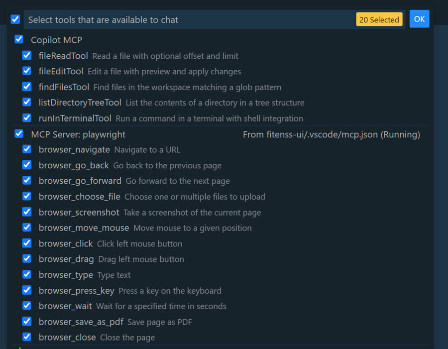

# Prompt list

- [ ] **Task 1**: Work with GitHub
- [ ] **Task 2**: Setup Tooling
- [ ] **Task 3**: Scaffold project structure
- [ ] **Task 3**: Implement the Web Api using Vibe Coding
- [ ] **Task 3**: Implement the Angular App using Vibe Coding
- [ ] **Task 5**: [Implement & Integrate a Playwright MCP (Model Context Protocol) Service](#task-5-implement--integrate-a-playwright-mcp-model-context-protocol-service)
- [ ] **Task 6**: Implement tests using Vibe Coding
- [ ] **Task 7**: Implement Bicep in infra folder using Vibe Coding(#task-7-implement-bicep-in-infra-folder-using-vibe-coding)
- [ ] **Task 8**: Add a CI/CD pipeline using Azure DevOps

> Note: Task 6-8 are not included in this repository. They are [GitHub Issues](https://github.com/alexander-kastil/copilot-skills-fest/issues) waiting to be addressed.

The Tasks were executed by the GutHub Copilot Agent mostly using Claude Sonnet 3.7 with these [Visual Studio Code Settings](/prompts/assets/general/settings.json)


## Task 1: Work with GitHub

This task is an introduction to using GitHub Copilot in a collaborative environment. It covers creation of a branch, committing changes and creating pull requests.

```prompt
Create a new branch 'initial-setup' and switch to it
```

> Note: At the end of task 3 we will merge the branch into main.

## Task 2: Setup Tooling

- Setup the project tooling:

```prompt
Setup the coding instructions and tooling for the project mentioned in docs/mona-high-school-fitness-tracker.md. Do not change any content of the files you copy. Stop after scaffolding the projects.
```

- Create a development container configuration for consistent environments and easy onboarding of new team members add the re-usable prompt `create-dev-container.prompt.md`:

> Note: Skip this step as we have already created the devcontainer.json to meet our 45 min time limit. Building the container image takes a while. The prompt is included for reference.

```prompt
Create the devcontainer
```

- Run the `devcontainer` locally and using `GitHub CodeSpaces`

## Task 2: Configure Copilot tooling and scaffold project structure

This task install some Copilot Settings and Tools and establishes the foundation for our fitness tracking application according to `docs/octofit_story.md` by creating both the .NET API and Angular frontend projects according to the guides in `docs/mona-high-school-fitness-tracker.md`. It includes setting up proper project structures, defining development environments with devcontainer configurations, and establishing basic project hygiene like source control settings.

- Get a big picture of the project using the `docs/octofit_story.md` and `docs/mona-high-school-fitness-tracker.md` files:

  ```prompt
  Read the files docs/octofit_story.md and docs/mona-high-school-fitness-tracker.md and summarize the requirements of the project. Do not implement anything yet. Just get an overview of the requirements. Draw a directory tree of the project.
  ```

- Initial prompt to set up both .NET and Angular projects:

  ```prompt
  Execute the steps mentioned in 'Task: Scaffold Projects' of docs/mona-high-school-fitness-tracker.md. Stop after this section.
  ```

- Check the outcome of the scaffolding process. Run the `octofit-api`

  ```prompt
  The octofit-api is already running. Navigate to `http://localhost:5000/` using the browser and describe the result. Check if the default WeatherForecast method is present. Navigate to http://localhost:5000/weatherforecast and describe the json.
  ```

## Task 3: Implement the Web Api

This task focuses on setting up the back-end API functionality including data models, controllers, and database integration. It establishes the core business logic and data access layer that will serve student and exercise data to the Angular frontend. Details are defined in `docs/mona-high-school-fitness-tracker.md`

```prompt
Implement the requirements mentioned in '## Task: Implement the Web Api' of docs/mona-high-school-fitness-tracker.md. Do nothing else and stop after this section.
```

## Task 3: Configure the Angular App

This task implements the front-end user interface by creating Angular components, services, and routing configurations. It establishes the connection between the Angular app and the .NET API, ensuring proper data display and user interaction.

- Add Angular project specific Copilot settings using .vscode/settings.json. Take the content from [assets](/prompts/assets/angular/):

  ```json
  {
      "github.copilot.chat.codeGeneration.instructions": [
          {
              "file": ".angular.copilot.md"
          }
      ],
      "github.copilot.chat.testGeneration.instructions": [
          {
              "file": ".angular.tests.copilot.md"
          }
      ],
      "github.copilot.chat.setupTests.enabled"   : true,
      "github.copilot.chat.startDebugging.enabled": true,
      "chat.commandCenter.enabled": true,
  }
  ```

- Creating the component structure and navigation for the Angular app:

  ```prompt
  Add the following components to the Angular app:

  - Home
  - Students
  - Exercises
  - Shared/Navbar

  Add the links to the Navbar and the routing to the app.routing.ts.
  Add a router-outlet to the app.component.html. The Navbar should have 100px. The container for the router-outlet should fit the rest of the screen
  ```

- Add a service to the Angular app that uses the HttpClient to call the API.

- Implementing API communication services in Angular:

  ```prompt
  Add a students service to the Angular app that uses the HttpClient to call the API. Register the HttpClient in app.config.ts using the provide function. Implement the methods getStudent and getStudents. Create client side model classes that match the API models. Update the hadrdcoded implementation of the Students component to use the service. Fix the template and use Control Flow syntax
  ```

- Adding CORS configuration to the API:

  ```prompt
  In the api Program.cs add a CORS rule to allow all request form all domains on all methods
  ```

- Troubleshooting data display issues:

  ```prompt
  there are no students displayed on the page. data is returned. Angular Dev Tools show the following state as in the screenshot
  ```

- Adding diagnostic logging to fix data display issues:

  ```prompt
  still no output so please add terminal logging to the students component so you can examine it and fix the error
  ```

## Task 4: Add project documentation using a reusable prompt

This task improves the project's documentation by leveraging reusable GitHub Copilot prompts. It demonstrates how to create, attach, and utilize custom prompts to generate comprehensive documentation for the application.

- Create docs using a saved prompt in `.github/prompts/*.prompt.md`

  

- Attach the prompt

  

- Use the attached prompt to create the documentation

  

## Task 5: Implement & Integrate a Playwright MCP (Model Context Protocol) Service

This task enhances the development workflow by adding Playwright MCP capabilities that allow GitHub Copilot to interact with the application through a browser. It demonstrates the power of AI-assisted development with visual context awareness for more sophisticated application testing and development.

- Add Playwright to `.vscode/mcp.json` in the fitness-ui project. This will allow the agent to interact with the application using the browser. We could also install Playwright in the root project.

  ```json
  {
      "servers": {
          "playwright": {
              "command": "npx",
              "args": [
                  "@playwright/mcp@latest",
                  "--vision"
              ]
          }
      }
  }
  ```

- Restart the tools using the command palette. This will install Playwright and start the MCP server.

  

- Check if the tools are available by clicking on `Select tools` in your agents control center

  

- Check if the tools are working correctly:

  ```prompt
  Navigate to http://localhost:4200/ and describe the result. Do nothing else.
  ```
